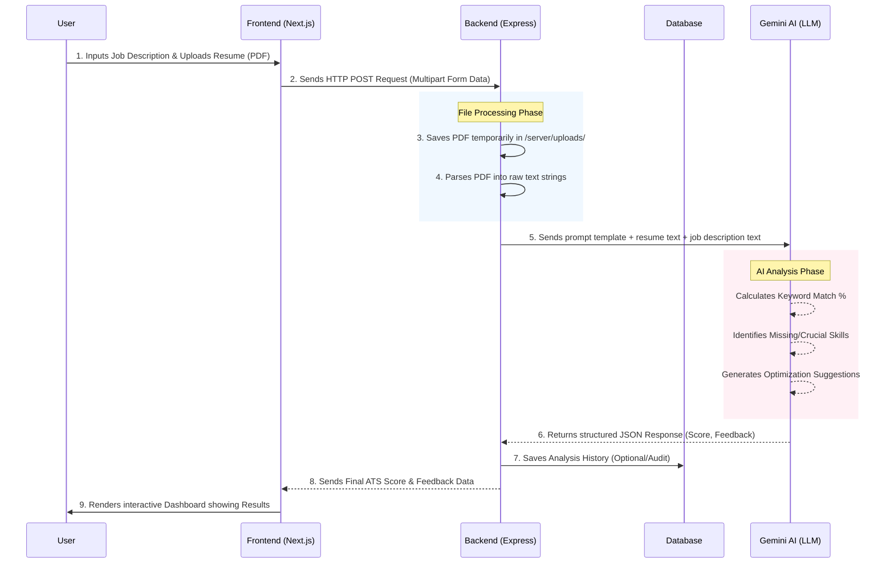

# ATS Resume Checker - Project Report Draft

This document outlines the standard headings required for your college project report, alongside explanations of what to include in each section, and a full write-up for the **Source Code** section containing your architecture.

---

## **Table of Contents**
An index listing all sections, sub-sections, and their page numbers. It helps readers quickly navigate to specific parts of the document.

## **Acknowledgement**
A section where you express gratitude to people who helped with your project — professors, mentors, peers, family, or institutions that provided resources or guidance.

## **Abstract**
A **brief summary** (150–300 words) of the entire project. It covers the **problem**, **approach**, **technology used**, and **key results** — giving readers a quick overview without reading the full report.

---

## **1. Introduction**
Sets the stage for your project. It covers:
- **Background** of the problem domain (e.g., the modern hiring process and the rise of ATS integration).
- **Problem statement** — the issue your project solves (candidates getting rejected due to poor keyword matching despite being qualified).
- **Objectives** — what you aim to achieve with this resume checking tool.
- **Scope** — boundaries of what the project covers.

## **2. Project Description**
A detailed narrative of **what your project does**. For your ATS Resume Checker, this describes:
- How users upload their PDF resumes and target job descriptions.
- How the system securely parses and analyzes these documents.
- Core features like scoring, keyword matching, and AI-driven feedback.

## **3. System Requirements**

### 3.1 Hardware Requirements
Minimum hardware needed to run the project (RAM, processor, storage, etc.) on a local machine or server.

### 3.2 Software Requirements
Software and tools needed — Operating System, Browser, Node.js environment, preferred Database, etc.

### 3.3 Software Description
A brief explanation of **each major technology** used and **why** you chose it:
- Next.js and React (Frontend)
- Node.js and Express.js (Backend)
- Google Gemini API (AI Analysis)
- TailwindCSS (Styling)

## **4. System Design**

### 4.1 Existing System / Literature Survey
- What solutions already exist (e.g., Jobscan, Resumeworded)?
- What are their **limitations** (e.g., expensive, outdated algorithms)?
- Research papers or articles you benchmarked against.

### 4.2 Proposed System
- How your system **improves** upon existing ones.
- High-level architecture overview.
- Advantages of using a headless decoupled approach with Gemini AI.

### 4.3 Data Flow Diagram (DFD)
Visual diagrams showing **how data moves** through your system:
- **Level 0 (Context Diagram)**: High-level User → ATS System → Output Score.
- **Level 1**: Breaks down into sub-processes (Upload → Parse PDF → Call Gemini API → Display Display Results).

### 4.4 Algorithms (AI Component)
Explain:
- The AI models used (Google Gemini).
- How the AI is prompted to evaluate the parsed resume text against the job description text.
- Keyword extraction techniques and similarity scoring mechanics.

---

## **5. Source Code**

This section outlines the directory structure of the ATS Resume Checker project. The system is built using a modern decoupled architecture, separating the client-side UI (Next.js) from the server-side API (Node.js/Express). 

### **5.1 File Structure**

Below is the high-level hierarchical file structure of the project:

```text
ATS-resume-checker/
│
├── next.config.ts          # Configuration for the Next.js frontend framework
├── tailwind.config.ts      # Tailwind CSS styling configuration
├── package.json            # Frontend dependencies and scripts (React, Next, etc.)
├── .env                    # Environment variables (Frontend API keys, URLs)
│
├── src/                    # FRONTEND SOURCE CODE (Next.js)
│   ├── app/                # Next.js App Router: Contains individual pages & layouts
│   ├── components/         # Reusable UI components (Buttons, Modals, Upload forms)
│   ├── context/            # Global state management using React Context API 
│   └── lib/                # Utility functions, API connection logic, and helper scripts
│
└── server/                 # BACKEND SOURCE CODE (Node.js & Express)
    ├── package.json        # Backend dependencies (Express, Multer, Mongoose, etc.)
    ├── .env                # Backend environment variables
    ├── dropDB.js           # Utility script to reset/drop database instances
    ├── uploads/            # Temporary directory where uploaded resumes are stored
    │
    └── src/                # Backend Core Logic
        ├── controllers/    # Handles business logic (Parsing resumes, calling AI)
        ├── routes/         # Defines API endpoints (e.g., POST /api/analyze)
        ├── models/         # Database schemas (e.g., User, ResumeData)
        └── index.js        # Main entry point that starts the Express server
```

### **5.2 Deep Explanation of the Structure**

The architecture is meticulously organized into two independent environments: **Frontend (`src/`)** and **Backend (`server/`)**.

#### **A. The Frontend Environment (`/src`)**
Built using **Next.js** and **Tailwind CSS**, this handles everything the user interacts with.
*   **`src/app/`**: Utilizes Next.js's App Router system. Each sub-folder represents an actual route/page on the website.
*   **`src/components/`**: UI elements like the "Upload Drag-and-Drop Box" and "Job Match Cards" are isolated here. This promotes reusability.
*   **`src/context/`**: Manages global React states. Once a resume is scored, results are stored in the context so they can be accessed without re-fetching from the database.
*   **`src/lib/`**: Contains helper files that handle tasks like formatting dates or securely sending HTTP requests to the backend.

#### **B. The Backend Environment (`/server`)**
Built using **Node.js** and **Express.js**, the backend is responsible for file processing, Artificial Checkerligence integration, and data storage.
*   **`server/uploads/`**: When a user submits a PDF resume, `Multer` temporarily stores the unparsed file here. 
*   **`server/src/routes/`**: Acts as the traffic director. Routes API calls to the correct controller.
*   **`server/src/controllers/`**: The "brain" of the backend. Extracts text from the PDF, bundles it with the Job Description, and proxies the request to the Google Gemini AI API.
*   **`dropDB.js`**: A database administration script for quickly flushing mock data during testing.

### **5.3 System Architecture and Data Flow Diagram**

The following flowchart illustrates the exact sequence of events during a resume analysis:



---

## **6. Experimental Results**

### 6.1 Datasets or Database Flow Diagram
- If using a database: Explain your MongoDB schema diagrams or JSON documents layout.
- If using datasets: Detail how you tested the system (e.g., using 50 real resumes versus 50 fake resumes).

### 6.2 Results / Sample Screenshots
Screenshots of your working application:
- **Screenshot 1**: The homepage and file upload zone.
- **Screenshot 2**: The loading state or analysis screen.
- **Screenshot 3**: The final ATS Score, Keyword matches, and suggestions.
*(Ensure each screenshot has a caption below it explaining the feature).*

### 6.3 Performance Analysis
- **Accuracy**: Does the Gemini API correctly identify missing skills based on the JD?
- **Speed**: How fast does the Express server parse the PDF and return the AI's response?
- **Scalability**: Note any limitations in concurrent API requests.

## **7. Conclusion and Future Directions**
- **Conclusion**: Summarize that you successfully built a decoupled full-stack application leveraging the Gemini LLM to solve real-world ATS rejection issues.
- **Future Directions**: Discuss adding support for DOCX formats, integrating directly with LinkedIn APIs (as discussed in previous development logs!), or adding multi-language support.

## **8. References**
List all sources cited:
- Next.js Documentation (https://nextjs.org/docs)
- Express.js Documentation (https://expressjs.com/)
- Google Gemini API Docs
- Any external GitHub repositories, libraries (pdf-parse, multer), or YouTube tutorials used.
