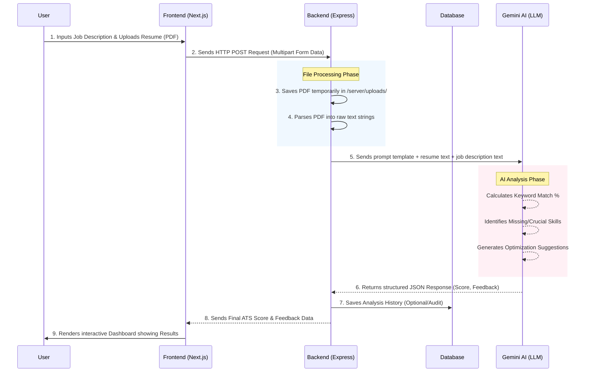

## **5. Source Code**

This section outlines the directory structure of the ATS Resume Checker project. The system is built using a modern decoupled architecture, separating the client-side UI (Next.js) from the server-side API (Node.js/Express). 

### **5.1 File Structure**

Below is the high-level hierarchical file structure of the project:

```text
ATS-resume-checker/
│
├── next.config.ts          # Configuration for the Next.js frontend framework
├── tailwind.config.ts      # Tailwind CSS styling configuration
├── package.json            # Frontend dependencies and scripts (React, Next, etc.)
├── .env                    # Environment variables (Frontend API keys, URLs)
│
├── src/                    # FRONTEND SOURCE CODE (Next.js)
│   ├── app/                # Next.js App Router: Contains individual pages & layouts (e.g., page.tsx, layout.tsx)
│   ├── components/         # Reusable UI components (Buttons, Modals, Resume Upload forms)
│   ├── context/            # Global state management using React Context API 
│   └── lib/                # Utility functions, API connection logic, and helper scripts
│
└── server/                 # BACKEND SOURCE CODE (Node.js & Express)
    ├── package.json        # Backend dependencies (Express, Multer, Mongoose, etc.)
    ├── .env                # Backend environment variables (Database URI, Gemini API keys)
    ├── dropDB.js           # Utility script to reset/drop the database instances
    ├── uploads/            # Temporary directory where uploaded resumes (PDFs) are stored before parsing
    │
    └── src/                # Backend Core Logic
        ├── controllers/    # Handles business logic (Parsing resumes, calling AI API, scoring)
        ├── routes/         # Defines API endpoints (e.g., POST /api/analyze)
        ├── models/         # Database schemas (e.g., User, ResumeData)
        └── index.js        # Main entry point that starts the Express server
```

### **5.2 Deep Explanation of the Structure**

The architecture is meticulously organized into two independent environments: **Frontend (`src/`)** and **Backend (`server/`)**.

#### **A. The Frontend Environment (`/src`)**
Built using **Next.js** and **Tailwind CSS**, this handles everything the user interacts with.
*   **`src/app/`**: This utilizes Next.js's App Router system. Each sub-folder here represents an actual route/page on the website (e.g., the dashboard, the upload page, and the results page).
*   **`src/components/`**: To maintain clean code, UI elements like the "Upload Drag-and-Drop Box", "Score Progress Bars", and "Job Match Cards" are isolated here. This promotes reusability across different pages.
*   **`src/context/`**: Manages global React states. For instance, once a resume is uploaded and scored, the results are stored in the context so they can be accessed by the "Results" and "Suggestions" screens without needing to reload or re-fetch from the database.
*   **`src/lib/`**: Contains helper files (like `utils.ts` or `api.ts`) that handle standard tasks like formatting dates, parsing strings, or securely sending HTTP POST requests to the backend server.

#### **B. The Backend Environment (`/server`)**
Built using **Node.js** and **Express.js**, the backend is responsible for the heavy lifting: file processing, Artificial Checkerligence integration, and data storage.
*   **`server/uploads/`**: When a user submits a PDF resume, `Multer` (a Node.js middleware) temporarily stores the unparsed file here. 
*   **`server/src/routes/`**: Acts as the traffic director. When the frontend asks to analyze a resume, the router intercepts the `POST /analyze` request and forwards it to the correct controller.
*   **`server/src/controllers/`**: This is the "brain" of the backend. 
    1. It reads the file from `/uploads`.
    2. Extracts the text from the PDF using a PDF parser.
    3. Bundles the extracted text with the user's target Job Description.
    4. Sends a specialized prompt to the **Google Gemini AI API** to evaluate the match percentage, identify missing keywords, and generate feedback.
*   **`dropDB.js`**: A database administration script allowing developers to quickly flush old mock data during testing phases.

---

### **5.3 System Architecture and Data Flow Diagram**

The following flowchart illustrates the exact sequence of events from the moment a user uploads a resume, to the point where the AI generates an ATS score.



### **Flow Diagram Explanation:**
1. **User Input:** The user provides their Target Job Description (via text box) and their Current Resume (via file upload) on the Next.js frontend.
2. **API Transmission:** The frontend packages this data and sends it securely to the Node.js backend URL.
3. **Data Extraction:** The backend receives the file, stores it locally, and runs a PDF parsing algorithm to translate the document layout into machine-readable raw text.
4. **AI Processing:** The backend acts as a proxy, sending the parsed resume and job description to the AI engine (Gemini API) using a strict instructional prompt asking it to behave like a strict ATS (Applicant Tracking System).
5. **Data Synthesis & Display:** The AI returns the calculated metrics. The backend routes this data back to the frontend, which dynamically updates its Context State and renders the final ATS score visually for the user.
